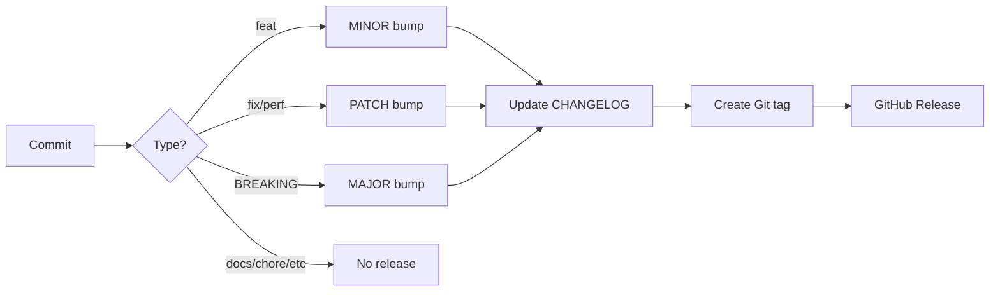

# Commit Message Standards

This project follows the [Conventional Commits](https://www.conventionalcommits.org/) specification for all commit messages.

**CRITICAL**: This project uses **Semantic Release** for automated versioning. Commit messages MUST follow the exact format below to ensure proper version bumping and changelog generation.

## Commit Structure

All commits must follow this **exact format**:

```
<type>(<scope>): <subject>

<body>

<footer>
```

## Version Impact by Commit Type

Understanding how commit types affect versioning (following [Semantic Versioning](https://semver.org/)):

### 🚀 MINOR Version Bump (0.1.0 → 0.2.0)

- **feat**: New feature or functionality
  - Triggers a **MINOR** version increase
  - Example: `feat(auth): add oauth2 authentication`

### 🐛 PATCH Version Bump (0.1.0 → 0.1.1)

- **fix**: Bug fix or correction
  - Triggers a **PATCH** version increase
  - Example: `fix(api): resolve memory leak in user service`

- **perf**: Performance improvements
  - Triggers a **PATCH** version increase
  - Example: `perf(database): optimize query performance`

### 💥 MAJOR Version Bump (0.1.0 → 1.0.0)

- **Any type with BREAKING CHANGE** in footer or `!` after type/scope
  - Triggers a **MAJOR** version increase
  - Examples:
    - `feat(api)!: change user endpoint response structure`
    - `fix!: remove deprecated endpoints`

### 📝 NO Version Bump (No Release)

These types do NOT trigger a release:

- **docs**: Documentation only changes
- **style**: Code style/formatting (no logic changes)
- **refactor**: Code restructuring (no behavior changes)
- **test**: Adding or updating tests
- **chore**: Maintenance, dependencies, configs
- **ci**: CI/CD pipeline changes
- **build**: Build system or external dependencies
- **revert**: Revert previous commit

## Type Reference (Required)

Must be **one** of the following (case-sensitive, lowercase only):

| Type       | Version Impact | When to Use                  | Example                             |
| ---------- | -------------- | ---------------------------- | ----------------------------------- |
| `feat`     | **MINOR** ⬆️   | New feature or functionality | `feat(auth): add password reset`    |
| `fix`      | **PATCH** ⬆️   | Bug fix or correction        | `fix(api): handle null values`      |
| `perf`     | **PATCH** ⬆️   | Performance improvements     | `perf(db): add query indexes`       |
| `docs`     | None           | Documentation only           | `docs(readme): update setup guide`  |
| `style`    | None           | Formatting, no code change   | `style(api): fix indentation`       |
| `refactor` | None           | Code restructuring           | `refactor(service): simplify logic` |
| `test`     | None           | Adding/updating tests        | `test(auth): add unit tests`        |
| `chore`    | None           | Maintenance, dependencies    | `chore(deps): update nestjs`        |
| `ci`       | None           | CI/CD changes                | `ci(github): add release workflow`  |
| `build`    | None           | Build system changes         | `build(webpack): update config`     |
| `revert`   | None           | Revert previous commit       | `revert: feat(auth): add oauth2`    |

### Scope (Optional but Recommended)

- Single word identifying the affected component/module
- **Must be lowercase only**
- Examples: `auth`, `api`, `database`, `config`, `user`, `deps`
- Helps organize changelog by component
- Example: `feat(auth): add jwt validation` → Changelog section "Auth"

### Subject (Required)

- **MUST use imperative mood** ("add" not "added" or "adds")
- **MUST be lowercase** (enforced by commitlint)
- **NO period at the end**
- **Maximum 72 characters** (enforced by commitlint)
- Clear and concise description of the change
- Examples:
  - ✅ `add user authentication endpoint`
  - ✅ `fix null pointer in user service`
  - ❌ `Added user authentication endpoint` (not imperative)
  - ❌ `Add user authentication endpoint.` (has period)
  - ❌ `Fix bug` (too vague)

### Body (Optional but Recommended for feat and fix)

- Detailed explanation of **what** and **why** (not how)
- Wrap at 72 characters per line
- Use blank line to separate from subject
- Can have multiple paragraphs (separate with blank lines)
- Include:
  - Motivation for the change
  - Contrast with previous behavior
  - Technical implementation details
  - Impact on other parts of the system

### Footer (Optional but Important)

#### Breaking Changes (MAJOR version bump)

**Two ways to indicate breaking changes:**

1. **Using `!` after type/scope** (recommended for visibility):

   ```
   feat(api)!: change user endpoint response
   ```

2. **Using `BREAKING CHANGE:` in footer**:

   ```
   feat(api): change user endpoint response

   BREAKING CHANGE: The /api/users endpoint now returns an object
   with 'data' and 'meta' properties instead of a plain array.
   ```

**MUST include**:

- Description of what breaks
- Migration instructions
- Affected APIs/interfaces

#### Issue References

- `Refs #issue-number` - References an issue
- `Closes #issue-number` - Closes an issue
- `Fixes #issue-number` - Fixes a bug issue
- Multiple: `Closes #issue-number, #another-issue`

## Examples for Semantic Release

### Feature (MINOR bump)

```
feat(auth): add jwt token validation middleware

Implements middleware to validate JWT tokens on protected routes.
Uses jsonwebtoken library for token verification and adds proper
error handling for expired or invalid tokens.

The middleware can be applied to any route using @UseGuards()
decorator and automatically validates token expiration and
signature.

Closes #issue-number
```

**Result**: Version 1.0.0 → 1.1.0, appears in CHANGELOG under "Features"

### Bug Fix (PATCH bump)

```
fix(api): resolve null pointer exception in user service

Adds null check before accessing user.profile to prevent crashes
when user profile is not initialized.

This fixes an issue where newly created users without profiles
would cause the API to crash when fetching user details.

Fixes #issue-number
```

**Result**: Version 1.1.0 → 1.1.1, appears in CHANGELOG under "Bug Fixes"

### Performance Improvement (PATCH bump)

```
perf(database): optimize user query with indexes

Adds composite index on (email, status) columns to speed up
user lookup queries by 80%.

Before: ~500ms average query time
After: ~100ms average query time

Refs #issue-number
```

**Result**: Version 1.1.1 → 1.1.2, appears in CHANGELOG under "Performance Improvements"

### Breaking Change with `!` (MAJOR bump)

```
feat(api)!: change user endpoint response structure

Refactors the /api/users endpoint to return paginated results
with metadata instead of plain array.

BREAKING CHANGE: The /api/users endpoint now returns an object
with 'data' and 'meta' properties instead of a plain array.

Migration guide:
- Before: response.data was an array
- After: response.data.data is the array
- New: response.data.meta contains pagination info

Clients must update to access user.data instead of the root array.

Closes #issue-number
```

**Result**: Version 1.1.2 → 2.0.0, appears in CHANGELOG under "BREAKING CHANGES"

### No Release Commits

#### Documentation

```
docs(readme): update installation instructions

Adds section about required Node.js version and pnpm installation
steps for new contributors.
```

**Result**: NO version bump, does NOT appear in CHANGELOG

#### Chore

```
chore(deps): update nestjs to v11.0.1

Updates @nestjs/core, @nestjs/common, and @nestjs/platform-express
to latest stable version.
```

**Result**: NO version bump, does NOT appear in CHANGELOG

#### Refactor

```
refactor(service): simplify user validation logic

Extracts validation logic into separate private methods for
better readability and maintainability. No behavioral changes.
```

**Result**: NO version bump, does NOT appear in CHANGELOG

## Common Mistakes to Avoid

### ❌ Wrong Type Case

```
Feat(auth): add oauth2    ❌ Type must be lowercase
FEAT(auth): add oauth2    ❌ Type must be lowercase
```

### ❌ Subject Not Imperative

```
feat(auth): added oauth2        ❌ Use "add" not "added"
feat(auth): adds oauth2         ❌ Use "add" not "adds"
feat(auth): adding oauth2       ❌ Use "add" not "adding"
```

### ❌ Subject Capitalized

```
feat(auth): Add oauth2          ❌ Subject must be lowercase
```

### ❌ Subject with Period

```
feat(auth): add oauth2.         ❌ No period at the end
```

### ❌ Missing Space After Colon

```
feat(auth):add oauth2           ❌ Must have space after colon
```

### ❌ Subject Too Long

```
feat(auth): add oauth2 authentication with google, facebook, and github providers  ❌ Over 72 chars
```

### ✅ Correct Format

```
feat(auth): add oauth2 authentication

Implements OAuth2 authentication with support for Google,
Facebook, and GitHub providers using passport.js strategy.
```

## Tools

### Interactive Commit Creation (Recommended)

Use Commitizen for guided commit creation that ensures proper format:

```bash
pnpm run commit
```

This interactive tool will:

- ✅ Prompt for type (with descriptions)
- ✅ Prompt for scope
- ✅ Enforce character limits
- ✅ Guide you through body and footer
- ✅ Validate format before committing

### Manual Commit

If committing manually, use:

```bash
git commit -m "type(scope): subject"
```

**Note**: Commitlint will validate your message and **reject** it if it doesn't follow the rules.

## Validation Rules (Enforced by Commitlint)

The following rules are **automatically enforced** on every commit:

| Rule                | Enforcement | Error if...                  |
| ------------------- | ----------- | ---------------------------- |
| `type-enum`         | Required    | Type not in allowed list     |
| `type-case`         | Required    | Type not lowercase           |
| `type-empty`        | Required    | Type is missing              |
| `subject-case`      | Required    | Subject not lowercase        |
| `subject-empty`     | Required    | Subject is missing           |
| `header-max-length` | Required    | Header exceeds 72 characters |

**Failed commits will be rejected** - you must fix the format before the commit is accepted.

## Best Practices for Semantic Release

1. **One logical change per commit**
   - Don't mix features and fixes in the same commit
   - Each commit should represent a single, coherent change

2. **Write descriptive subjects**
   - ❌ `fix: bug fix`
   - ✅ `fix(auth): prevent token expiration race condition`

3. **Use body for complex changes**
   - Always add body for `feat` and `fix` commits
   - Explain the "why" not just the "what"

4. **Reference issues**
   - Use `Closes #issue-number` to auto-close issues
   - Use `Refs #issue-number` to reference without closing

5. **Be careful with breaking changes**
   - Only use when truly breaking backward compatibility
   - Always include migration guide in footer
   - Use `!` for visibility: `feat(api)!: breaking change`

6. **Write in technical English**
   - All commits must be in English
   - Use consistent terminology

7. **Keep commits atomic**
   - Small, focused commits are better
   - Easier to review and revert if needed

8. **Review before committing**
   - Use `pnpm run commit` to avoid mistakes
   - Double-check the type affects versioning correctly

## Semantic Release Workflow



## Quick Reference

**Need a release?**

- New feature → `feat(scope): description`
- Bug fix → `fix(scope): description`
- Performance → `perf(scope): description`
- Breaking change → `feat(scope)!: description` + `BREAKING CHANGE:` in footer

**No release needed?**

- Documentation → `docs(scope): description`
- Dependencies → `chore(deps): description`
- Tests → `test(scope): description`
- Refactoring → `refactor(scope): description`

---

**Remember**: Semantic Release reads your commit history to determine versions. Write commits carefully! 🎯
